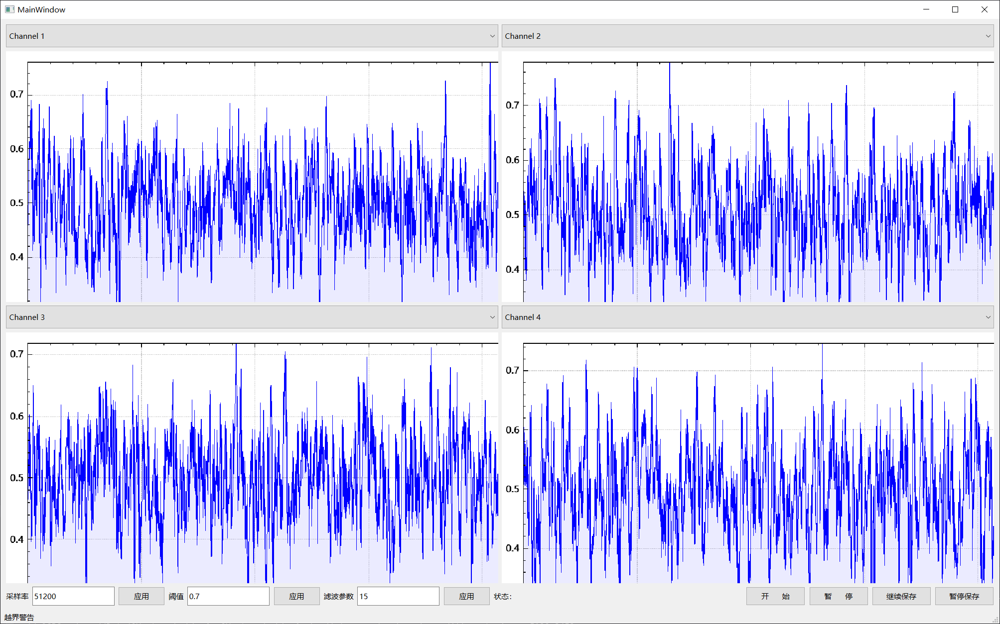
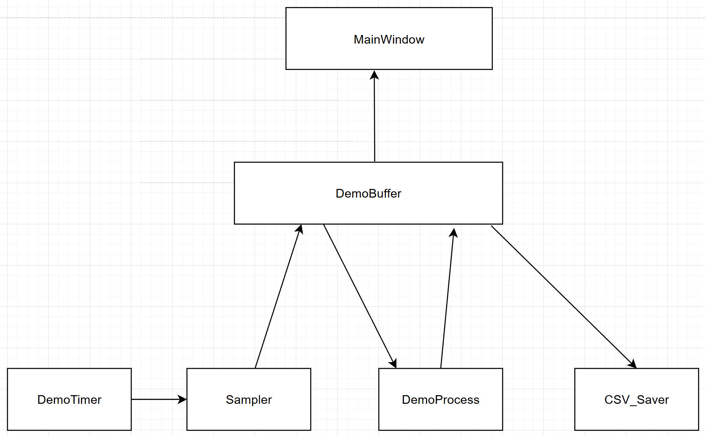

# 1 最终效果

## 1.1 已经实现功能
每秒采样 51200 * 32 个数据   \
自定义的高精度定时器，实现每秒采集 51200 次数据  \
滑动窗口均值滤波，默认100ms  \
使用 QCustomplot 绘制结果  \
原始数据写入csv文件。 写入过程可以暂停  

## 1.2 TODO
图形更新频率不低于20fps  \
滑动窗口均值滤波的窗口大小的配置  \
动态调整采样频率、滤波参数、告警阈值  \
在线峰值检测  \
丢滤波后的数据  \
稳定性测试  

# 2 题目理解
使用定时器来定时采集数据，采集的原始数据保存的csv文件中，将采集到的数据用均值滤波处理，在界面上使用QCustomPlot绘制结果

# 3 实现过程：
如下图所示， 每次处理一帧的数据, 处理完的数据保存在 DemoBuffer 中， MainWindow绘制 QCustomplot 时， \
会从 DemoBuffer 取处理后的数据，和记录中的数据比然后更新需要绘制到 QCustomplot 中的数据。   \
一帧数据: 包含了32通道采集一次的数据 + 坐标的 x 轴的自增值  

## 3.1 运行流程是：
    DemoTimer 发送 TimeOut_Sample 信号给 Sampler， 发送 TimeOut_Redraw 的信号给 MainWindow 。
    Sampler 收到 TimeOut_Sample 信号后采集一帧数据，发送 DataReady 信号给 DemoBuffer。
    DemoBuffer 收到 DataReady 的信号后， 从 Sampler 中获取一帧数据，发送 DemoProcessor_RecvData 信号 DemoProcessor 。
    DemoProcessor 收到 DemoProcessor_RecvData 信号后， 从 DemoBuffer 中拿最新一帧原始数据。 处理完毕后发送 DemoBuffer_FetchData 通知 DemoBuffer
    DemoBuffer 收到 DemoBuffer_FetchData 信号后， 从 DemoProcessor 中拿滤波后的一帧数据，保存的 mFilteredData。
    DemoTimer 发送重绘信号， MainWindow 接收信号后， 从 DemoBuffer 的 mFilteredData  中拿取多个的滤波后的数据做增量或者全量更新，重绘4个 QCustomplot
    CSV_SAVER 有最新的数据就接入文件，MainWindow 发送信号控制 CSV_SAVER 线程是否暂停写入数据

